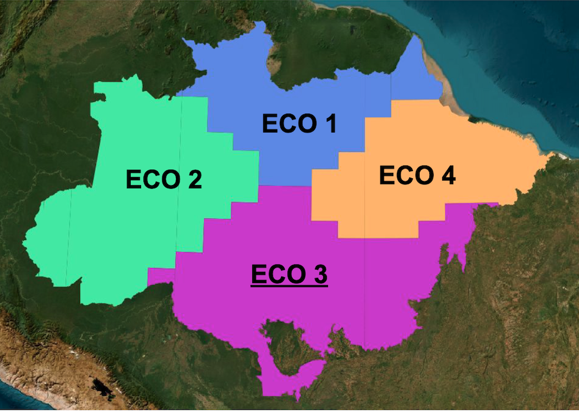
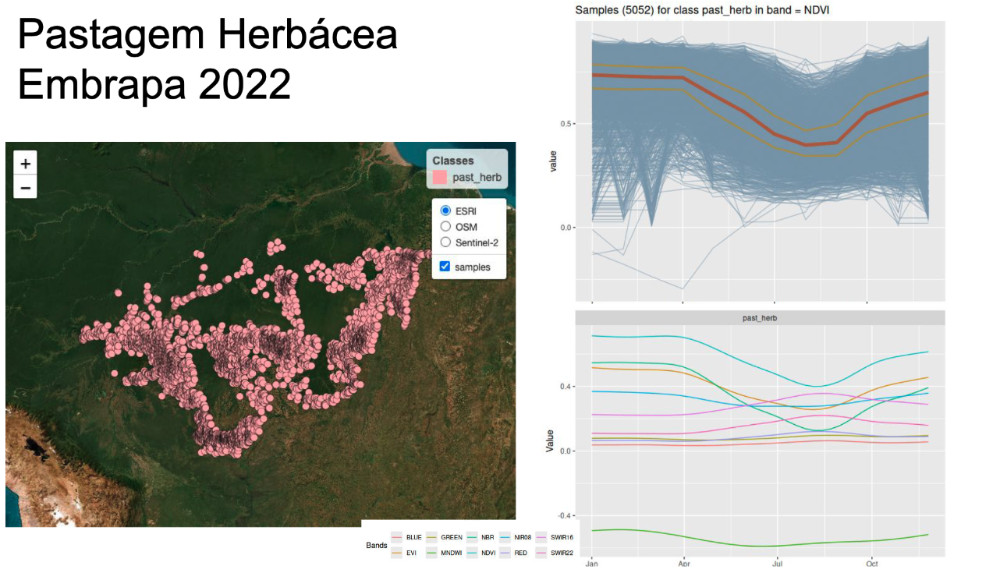
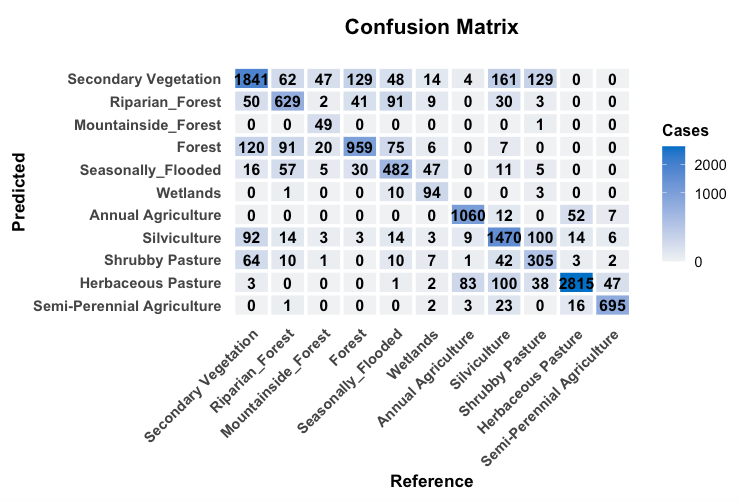
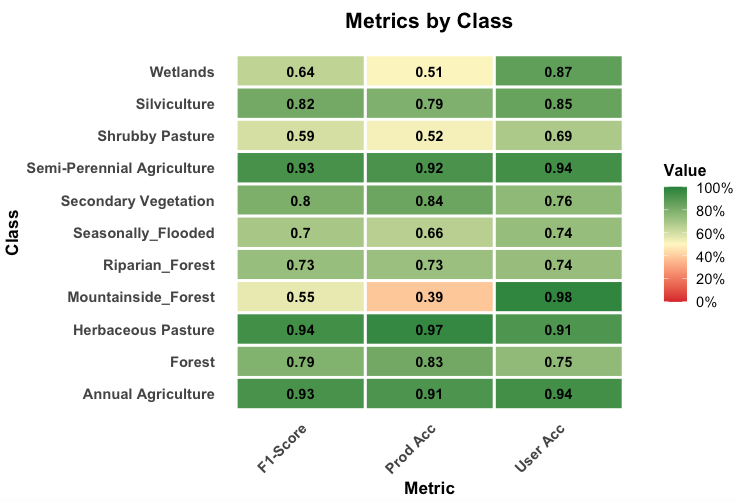
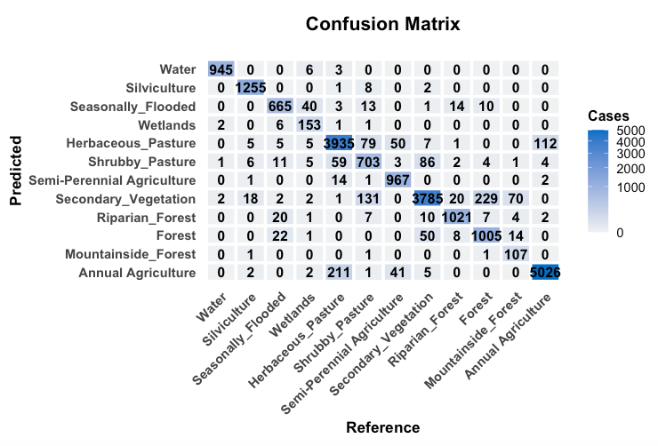
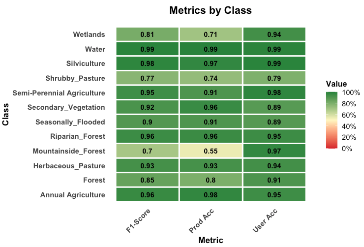

# Methods {-}

## Land Use and Land Cover Classes {-}

The Brazilian National Inventory of Greenhouse Gases Emissions (Inventory) defines a set of land use and land cover classes to be used to estimate the GHG emissions from the LULUCF (Land Use, Land Use Change and Forests) sector. However, some of these classes cannot reliably be identified in LANDSAT images, even with advanced machine learning methods. Therefore, the LUC-Brasil project has defined a set of classes relevant to the Inventory shown in @tbl-classes. These classes will later be converted to the Inventory LUCC classes.

|   IPCC Classes |  LUC BRAZIL Amazonia       | Description | 
|----------------|----------------------------|-------------|
| Forest         |  Primary Forest            | Natural forest as defined by PRODES |
|                |  Secondary Vegetation      | Regenerated or restored natural forest post-clear cuts |
|                | Silviculture               | Planted forest with exotic species | 
| Cropland       | Annual Agriculture         | One-cycle and two-cycle agriculture, mostly soy with corn or soy with cotton | 
|                | Semi-Perennial Agriculture | Sugarcane farms | 
|                | Perennial Agriculture      | Cocoa and Palm Oil large-scale plantations | 
| Grassland      | Pasture                    | Cattle-raising areas | 
|                | Natural Non-Forest Vegetation | Cerrado areas inside Amazon biome | 
| Wetland        | Water Bodies               | Rivers and Lakes | 
|                | Wetlands                   | Flooded area 
| Settlements    | Urban Areas                | Yearly or seasonally flooded areas with vegetation  | 
| Others         | Mining                     |  Large and medium-sized open-air mineral extraction | 
|                | Deforestation    | Areas cleared in the current year | 


: LULC classes in  LUC-Brazil Amazonia {#tbl-classes}

## Processing Overview {-}

The classification system operates through distinct stages, each handling a specific aspect of the data transformation pipeline from raw satellite imagery to final classified masks.

1. **Datacube Generation**: Landsat data from OGH and BDC is regularized into consistent 30m resolution time series for each year.
2. **Sample Selection and Analysis **: The project uses a large set of samples containing ground truth information for selected location, described in the data section. These samples are analyzed using: (a) visual interpretation of high-resolution images; (b) quality control methods including self-organized maps. If required, the training set is rebalanced to account for underrepresented classes.
3. **Model Training**; Using the cleaned set of samples to derive a machine learning model for classification based on the Random Forest algorithm. 
4. **Classification**: The Random Forest models classify regularized datacubes into initial land cover categories.
5. **Temporal Processing and Year-Specific Refinement**: Multi-year rules refine the classifications by analyzing temporal patterns. Individual annual masks undergo sequential reclassification rules.

## Stage 1: Datacube Generation {-}

The pipeline begins by ingesting Landsat imagery from two distinct sources, each optimized for different temporal periods. This stage produces regularized datacubes with consistent 30m spatial resolution and regular temporal intervals. These sources are described in the "Data" section.

Machine learning and deep learning (ML/DL) classification algorithms require the input data to be consistent. The dimensionality of the data used for training the model has to be the same as that of the data to be classified. There should be no gaps and no missing values. Thus, to use machine learning algorithms for remote sensing data, image collections should be converted to regular data cubes. The LUC-Brasil project uses regular data cubes produced by GLAD from the University of Maryland for the period 2000-2014 and by BDC for the period 2015-2024. The reason to use the GLAD data before 2015 is the limitations of the Landsat-5 and Landsat-7 satellites which were available in this period. The team at University of Maryland invested in reducing the radiometric and geometric problems of these satellites. To do so, they chose a two-month interval for their time series. By contrast, images in BDC from 2015 onwards rely primarily on the Landsat-8 satellite, which has a much better geometrical and radiometric quality than the previous Landsat satellites. For this reason, images from 2015 onwards have a one-month temporal interval. This multi-source temporal integration enables robust classification across the 25-year analysis period (2000-2024) despite varying data availability.

The Brazilian Amazon biome was divided into four ecoregions, according to their intrinsic natural variability and different patterns of human occupation (see @fig-ecoregions). This division was adopted to process the data cubes and perform the classification. Ecoregion 1 covers the Amapá and Roraima states, and parts of the Pará and Amazonas states in the North side of the Negro, Solimoes and Amazonas rivers. This region is largely preserved, but presents some deforestation hot-spots in Roraima. It also has a sizable non-forest area. Ecoregion 2 is the area bound by the Madeira and Negro rivers. It is mostly composed of native forest, except for the area encompassing the State of Acre and the area of recent deforestation expansion along the Transamazonica road. Ecoregion 3 is the most affected region by deforestation since the 1990s, with large areas of clearings with pasture and agriculture. This is the area of Amazonia that has registered the largest deforestation rates measured by INPE's PRODES system. Ecoregion 4 includes areas of long-term human occupation in the Pará State (Zona Bragantina) where there is significant presence of agroforestry and perennial agriculture (e.g., cocoa and oil palm). It is also the region of contact between Amazon and Cerrado biomes in the State of Maranhão.

```{r}
#| label: fig-ecoregions
#| echo: false
#| out.width: "90%"
#| fig.align: "center"
#| fig.cap: "Ecoregions of the Amazonia biome for classification"

```

## Stage 2: Sample Selection and Analysis {-}

The team analyzed the samples described in the "Data" section of this document using visual interpretation, exploratory data analysis, and quality assurance using self-organized maps (SOM). Among the four ecoregions, ECO3 was selected as the basis for defining the training sample set because it provided the best combination of sample coverage and land cover class variability and representativity. The visual analysis step consists of comparing the labelled samples from different sources with image backgrounds, which can be either high-resolution images (e.g., Planet) or mid-resolution images (e.g., Sentinel-2).

Exploratory data analysis refers to inspecting the sample's time series and also finding patterns in the data, as shown in @fig-methods-explor. On the left side, one can see the spatial location of the samples for herbaceous pasture provided by EMBRAPA. The graph on the top right shows all of the associated time series for the NDVI band, together with their median (shown in brown) and the first and third quartile ranges (shown in yellow). The graph on the lower right shows a plot that captures the temporal variability of herbaceous pasture samples in the different bands. We use a generalized additive model (GAM) to obtain a single time series based on statistical approximation.

```{r}
#| label: fig-methods-explor
#| echo: false
#| out.width: "90%"
#| fig.align: "center"
#| fig.cap: "Exploratory data analysis of herbaceous pasture samples"

```

The sample quality assurance part uses self-organizing maps (SOM), a clustering method where high-dimensional data is mapped into a two-dimensional map, The input data for quality assessment is a set of training samples, which are high-dimensional data; for example, a time series with 25 instances of 4 spectral bands has 100 dimensions. When projecting a high-dimensional dataset into a 2D SOM map. Each time series will be mapped to one of the neurons. Since the number of neurons is smaller than the number of classes, each neuron will be associated with many time series. The resulting 2D map will be a set of clusters. The neighbors of each neuron of a SOM map provide information on intraclass and interclass variability, which is used to detect noisy samples. The methodology of using SOM for sample quality assessment is discussed in detail in the reference paper [@Santos2021a]. 

Following the systematic sample analysis protocol, we defined a reference sample set from 2022 imagery, which was used to train a global model and classify maps for the 2015-2024 period. This sample set was subsequently transferred to the 2010 imagery, where an additional sample cleaning and selection procedure was performed to ensure consistency between the sample labels and the corresponding image features. The resulting training set was then used to train the model and to produce the maps for the 2000-2014 period. The two sample training sets are presented below. We first present the training set used for the 2000-2014 period (@tbl-samples-2010).

```{r}
#| label: tbl-samples-2010
#| echo: false
#| tbl-cap: "Training samples used to classify the 2000-2014 period"
suppressPackageStartupMessages(library(sits))

sample_table <- function(samples) {
  samples_summary <- summary(samples)

  data.frame(
    Class = c(stringr::str_replace(samples_summary$label, "_", " "), "**Total**"),
    Samples = format(c(samples_summary$count, sum(samples_summary$count)), big.mark = ",", trim = TRUE),
    `Proportion (%)` = sprintf("%.1f", 100 * c(samples_summary$prop, sum(samples_summary$prop))),
    check.names = FALSE
  )
}

# retrieve the samples for the 2000-2014 period
samples_amz_2010 <- readRDS("./etc/samples_amz_2010.rds")
knitr::kable(sample_table(samples_amz_2010), align = c("l", "r", "r"))
```

Some of the classes used in the training sample set are not included in the final LUC-Brazil classes. These include classes such as "Riparian_Forest", "Mountainside_Forest", and "Seasonally_Flooded". "Riparian_Forest" and "Mountainside_Forest" classes are useful to discriminate between different types of natural forests and are later aggregated into the "Forest" class. "Seasonally_Flooded" class was aggregated into the "Wetlands" class. Other classes produced by LUC-Brazil, such as "Perennial Vegetation" are not present in the data set and are added later using reclassification rules based on the TerraClass data. Extensive testing by the team shows that this class is difficult to detect using Landsat-5 and Landsat-7 images.

For the period 2015-2024, the distribution of the training set is shown in @tbl-samples-2020.

```{r}
#| label: tbl-samples-2020
#| echo: false
#| tbl-cap: "Training samples used to classify the 2015-2024 period"
# retrieve the samples for the 2015-2024 period
samples_amz_2020 <- readRDS("./etc/samples_amz_2020.rds")
knitr::kable(sample_table(samples_amz_2020), align = c("l", "r", "r"))
```

## Stage 3: Model Training 

After experimenting with the different algorithms available in `sits`, we chose the RandomForest method, which provides a reliable performance in the case of noisy data such as the images from Landsat-5 and Landsat-7 satellites. We performed a 5-fold validation of both models and the results are presented below.

The confusion matrix and the metrics for the 2000-2014 model are shown below.

```{r}
#| label: fig-kfold-2010-matrix
#| echo: false
#| out.width: "90%"
#| fig.align: "center"
#| fig.cap: "Confusion matrix for the 2000-2015 Random Forest model"

```


```{r}
#| label: fig-kfold-2010-metrics
#| echo: false
#| out.width: "90%"
#| fig.align: "center"
#| fig.cap: "Metrics for the 2000-2014 Random Forest model"

```

The results of the validation show a good degree of discrimination for the classes "Annual_Agriculture", "Semi-Perennial Agriculture", and "Herbaceous Pasture". The natural forest classes ("Forest", "Mountainside_Forest", "Riparian_Forest" and "Seasonally_Flooded") show a reasonable degree of internal confusion, which is not a big problem, since they will later aggreggated into a single class ("Forest"). The confusion between "Secondary_Vegetation" and "Forest" is to be expected; this confusion is solved using the PRODES maps.

Overall, the main problem is the distinction between the "Shrubby Pasture", "Secondary Vegetation" and "Silviculture" classes. While the TerraClass maps provide a good basis for improving the classification of "Semi=Perennial Agriculture" and "Silviculture" classes, the main problem remains in the distinction between "Shrubby Pasture" and  "Secondary Vegetation". Indeed, these classes are hard to separate even in higher-resolution images. 

The confusion matrix and the metrics for the 2015-2024 model are shown below.

```{r}
#| label: fig-kfold-2020-matrix
#| echo: false
#| out.width: "90%"
#| fig.align: "center"
#| fig.cap: "Confusion matrix for the 2015-2024 Random Forest model"

```


```{r}
#| label: fig-kfold-2020-metrics
#| echo: false
#| out.width: "90%"
#| fig.align: "center"
#| fig.cap: "Metrics for the 2015-2024 Random Forest model"

```

The results show that the 2014-2024 model discriminates the classes better than the 2000-2014 one. This outcome is expected due to the better quality of the Landsat-8 images. Compared to the 2000-2014 model, the "Silviculture" class is better defined, and the distinction between "Secondary Vegetation" and "Herbaceous Pasture" improves. The same remarks made earlier about the natural classes apply also in this case. 

## Stage 4: Datacube Classification {-}

The datacube classification is done on an yearly basis. For each year, each spatial location (pixel) of the data cubes is associated to a time series. Each time series is then classified by the machine learning model. The result is a classified map for each year. The classification process is described in the detail in the [on-line book](https://e-sensing.github.io/sitsbook/)  about the `sits` package.

## Stage 5: Reclassification rules {-}

After the annual classification maps have been produced, the LUC-Brazil team applies a series of reclassification rules, which are described in detail in the next section.

## References {-}


