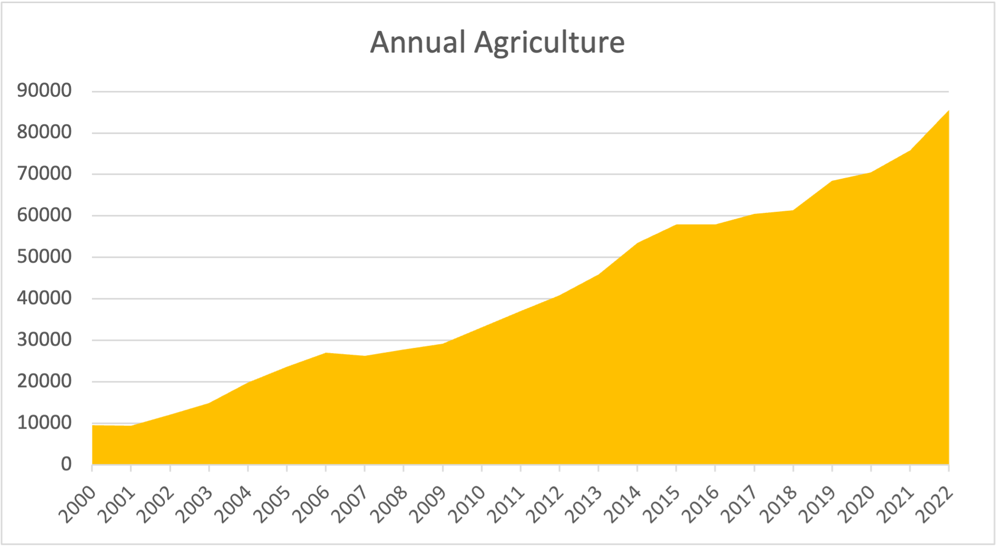
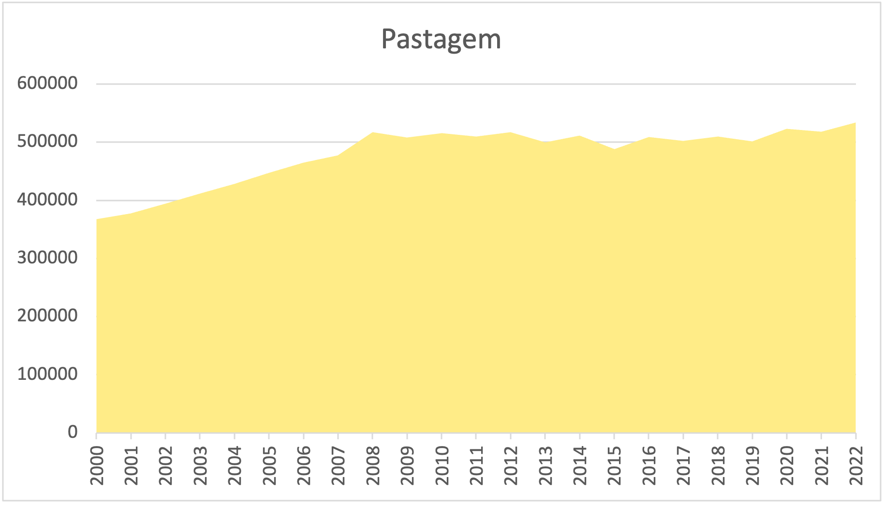
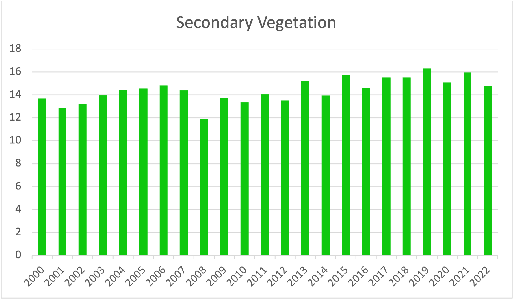

# Results {-}

The results of the LUC-Brasil project for the Amazon biome are a series of maps containing land use and land cover classes for the period 2000-2024. In the first version of the product, described in this document, covers years 2000 to 2022. 

## Data Availability

The 2000-2024 LUCC maps for the Brazilian Amazon biome are available in [Zenodo](https://doi.org/10.5281/zenodo.19341175).

## Main findings of the work 

### Increase in agricultural area

The area used for annual agriculture has increased significantly from about 1.0 Mha in 2000 to 7.5 Mha in 2022, the largest percentual gain for all mapped classes. This growth can be largely attributed to the expansion of soy plantations in the region.

```{r}
#| label: cropland
#| echo: false
#| out-width: 90%
#| fig-align: "center"
#| fig-cap: Annual agriculture area (Mha) in Amazonia (2000-2022)
 
```

The pasture area has remained fairly constant since 2008, ranging from 51 Mha to 54 Mha. One can speculate that this could be an effect of the Soy Moratorium. Working in Mato Grosso, Picoli et al. [@Picoli2020] provided evidence that soybean expansion has caused indirect impacts by replacing pasture areas and causing pasture expansion elsewhere. Therefore, annual agricultural caused an indirect land-use change effect, since the expansion of croplands takes place on pasture areas. 

```{r}
#| label: pasture
#| echo: false
#| out-width: 90%
#| fig-align: "center"
#| fig-cap: Pasture area (Mha) in Amazonia (2000-2022)
 
```

Secondary vegetation has remained fairly constant during the 2000-2020 period, ranging from 13 Mha to 15.5 Mha. When compared to the expansion of agriculture and spatial expansion of pasture, while keeping the total pasture area constant), these numbers suggest a period cycle of abandonment and reuse of part of the land.

```{r}
#| label: secveg
#| echo: false
#| out-width: 90%
#| fig-align: "center"
#| fig-cap: Pasture area (Mha) in Amazonia (2000-2022)
 
```

### Accuracy assessment {-}

Accuracy assessment was performed by comparing the Restore+ maps with the TerraClass reference data. The user's and producer's accuracies for the years 2008, 2010, 2012, 2014, 2016, 2018, 2020, and 2022 are presented in the table below.

**Producer's accuracy (%)**

::: {.table-responsive tabindex="0" role="region" aria-label="Producer's accuracy by class and year"}
| Class | 2008 | 2010 | 2012 | 2014 | 2016 | 2018 | 2020 | 2022 | 2024 |
|---|---|---|---|---|---|---|---|---|---|
| Annual Agriculture | 99.988% | 99.987% | 99.988% | 99.988% | 99.976% | 99.983% | 99.983% | 99.981% | 99.769% |
| Water | 93.152% | 93.503% | 92.930% | 93.309% | 93.113% | 94.757% | 93.502% | 94.469% | 97.571% |
| Primary Forest | 99.750% | 99.746% | 99.742% | 99.738% | 99.688% | 99.725% | 99.717% | 99.710% | 99.673% |
| Secondary Vegetation | 80.095% | 81.204% | 82.121% | 83.799% | 78.732% | 82.203% | 82.203% | 83.336% | 81.999% |
| Natural Non-Forest | 91.255% | 90.982% | 90.982% | 90.368% | 99.107% | 99.081% | 99.061% | 99.022% | 98.791% |
| Pasture | 98.487% | 98.575% | 98.699% | 98.802% | 98.380% | 98.447% | 98.588% | 98.489% | 98.546% |
| Current-Year Deforestation | 94.728% | 93.878% | 94.243% | 94.469% | 82.976% | 81.506% | 89.843% | 91.125% | 95.224% |
| Urban Area | 76.013% | 72.613% | 67.862% | 65.027% | 92.530% | 97.776% | 98.053% | 98.105% | 98.120% |
| Silviculture | 98.515% | 98.322% | 98.267% | 98.657% | 85.968% | 97.776% | 98.281% | 98.282% | 98.152% |
| Mining | 95.248% | 95.235% | 95.220% | 95.632% | 49.915% | 95.175% | 95.484% | 95.476% | 93.303% |
| Perennial Agriculture | 98.216% | 97.846% | 98.084% | 98.283% | 78.660% | 96.684% | 96.759% | 96.545% | 95.503% |
| Semi-Perennial Agriculture | 98.870% | 98.986% | 98.997% | 98.805% | 89.963% | 98.962% | 98.918% | 98.870% | 98.634% |
:::

**User's accuracy (%)**

::: {.table-responsive tabindex="0" role="region" aria-label="User's accuracy by class and year"}
| Class | 2008 | 2010 | 2012 | 2014 | 2016 | 2018 | 2020 | 2022 | 2024 |
|---|---|---|---|---|---|---|---|---|---|
| Annual Agriculture | 88.819% | 90.304% | 90.607% | 90.589% | 98.641% | 99.007% | 99.132% | 99.148% | 99.092% |
| Water | 98.434% | 98.439% | 98.442% | 98.437% | 97.374% | 97.697% | 97.570% | 97.090% | 97.699% |
| Primary Forest | 99.752% | 99.749% | 99.747% | 99.744% | 99.737% | 99.725% | 99.725% | 99.721% | 99.729% |
| Secondary Vegetation | 94.724% | 95.149% | 95.553% | 96.362% | 95.737% | 95.341% | 95.624% | 95.650% | 95.719% |
| Natural Non-Forest | 99.454% | 99.453% | 99.453% | 99.452% | 98.790% | 99.340% | 99.338% | 99.332% | 99.339% |
| Pasture | 81.949% | 82.884% | 77.049% | 83.513% | 92.045% | 93.616% | 93.913% | 94.472% | 94.013% |
| Current-Year Deforestation | 94.860% | 93.984% | 94.410% | 94.577% | 95.051% | 95.082% | 95.723% | 96.406% | 95.254% |
| Urban Area | 85.239% | 87.570% | 87.909% | 89.072% | 91.176% | 97.556% | 97.940% | 97.851% | 96.110% |
| Silviculture | 98.374% | 98.265% | 98.213% | 98.556% | 90.856% | 97.556% | 98.259% | 98.279% | 98.167% |
| Mining | 96.808% | 95.747% | 95.793% | 96.224% | 46.810% | 95.362% | 95.734% | 95.631% | 95.437% |
| Perennial Agriculture | 99.024% | 98.023% | 98.186% | 98.359% | 93.632% | 96.692% | 96.777% | 96.548% | 95.694% |
| Semi-Perennial Agriculture | 98.866% | 99.000% | 98.992% | 98.743% | 93.749% | 98.908% | 98.848% | 98.792% | 98.508% |
:::


## References
